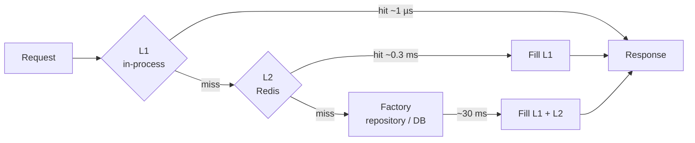

# HybridCache

[](https://github.com/paulap887/HybridCache/actions/workflows/ci.yml)

[](https://levelup.gitconnected.com/serve-api-responses-in-under-5ms-hybridcache-in-net-8a2457a5e639)

Companion code for the article **[Serve API Responses in Under 5ms: HybridCache in .NET](https://levelup.gitconnected.com/serve-api-responses-in-under-5ms-hybridcache-in-net-8a2457a5e639)**.

A minimal API demonstrating `Microsoft.Extensions.Caching.Hybrid` (HybridCache), the two-level caching abstraction introduced in .NET 9. It shows cache population, tag-based invalidation, and the L1 → L2 → factory lookup chain using a simple Product CRUD API, with integration tests, a Redis-backed CI run and BenchmarkDotNet numbers.

## What is HybridCache?

HybridCache sits in front of a backing store and maintains two cache layers:

| Layer | Store | Scope |
|-------|-------|-------|
| **L1** | In-process `IMemoryCache` | Single process / pod |
| **L2** | `IDistributedCache` (Redis, SQL, etc.) | Shared across all instances |



On a cache miss, HybridCache calls the factory function (your repository), stores the result in both layers, and returns it. Concurrent requests for the same key share one factory call (stampede protection). Subsequent requests hit L1 first, with no network round-trip.

## Measured performance

BenchmarkDotNet, Apple M1, .NET 9.0.4, Redis 7 in local Docker (`ShortRun` job). Your numbers will differ; run them yourself (see [Benchmarks](#benchmarks)).

**One `GetOrCreateAsync` call, by layer that served it:**

| Served by | Mean | Allocated |
|-----------|-----:|----------:|
| L1 hit (in-process memory) | **0.88 µs** | 208 B |
| L2 hit (Redis + deserialize) | 288 µs | 2,040 B |
| Miss (factory → repository, 30 ms simulated DB) | 31.1 ms | 1,448 B |

**Whole API request, cache warm** (routing + endpoint + HybridCache + JSON, in-memory `TestServer`, so no network):

| Endpoint | Mean |
|----------|-----:|
| `GET /products/1` | 16.5 µs |
| `GET /products` | 33.8 µs |

Over real HTTP on localhost, a cached `GET /products` measured about **1.5 ms** with `curl`, against about 127 ms for the first, uncached call. That is the "under 5 ms" from the article, with room to spare; in production, add your network round-trip.

## Getting Started

### Prerequisites

- [.NET 9 SDK](https://dotnet.microsoft.com/download)
- Docker (optional, for Redis L2 cache)

### Run L1-only (no Redis)

```bash
cd HybridCache.Api
dotnet run
```

The API starts on `http://localhost:5086`. With no Redis connection string, HybridCache runs with L1 only.

> **Note:** registering `AddDistributedMemoryCache()` would *not* give you an L2. HybridCache deliberately ignores `MemoryDistributedCache`, because an in-process "distributed" cache adds nothing over L1. See [Gotchas](#gotchas).

### Run with Redis (L1 + L2)

```bash
docker compose up -d
cd HybridCache.Api
dotnet run --launch-profile http-redis
```

The `http-redis` profile sets `ConnectionStrings__Redis`, and `Program.cs` registers `AddStackExchangeRedisCache` when that connection string is present. Any other way of setting `ConnectionStrings:Redis` works too (environment variable, user secrets, `appsettings`).

## API Endpoints

Base URL: `http://localhost:5086`

| Method | Path | Description |
|--------|------|-------------|
| `GET` | `/products` | List all products |
| `GET` | `/products/{id}` | Get product by ID |
| `POST` | `/products` | Create a product |
| `PUT` | `/products/{id}` | Update a product |
| `DELETE` | `/products/{id}` | Delete a product |

Interactive docs are available at `http://localhost:5086/scalar/v1` (Scalar UI). `HybridCache.Api/HybridCache.Api.http` has ready-made requests for VS Code / Rider / Visual Studio.

## Cache Behaviour

### Cache keys and tags

| Operation | Cache key | Tags applied |
|-----------|-----------|--------------|
| Get all | `products:all` | `products:list` |
| Get by ID | `product:{id}` | `product:{id}` |

### Invalidation strategy

Write operations use `RemoveByTagAsync` to bust exactly the entries that changed:

| Operation | Tags removed | Why |
|-----------|--------------|-----|
| **Create** | `products:list`, `product:{newId}` | The list is stale, and an earlier `GET` for the new id may have cached "not found" |
| **Update** | `products:list`, `product:{id}` | Both the item and the list contain the old values |
| **Delete** | `products:list`, `product:{id}` | Both the item and the list still contain the deleted product |

### Cache expiry defaults

| Setting | Value |
|---------|-------|
| L2 (distributed) expiration | 5 minutes |
| L1 (local memory) expiration | 1 minute |

## Tests

```bash
dotnet test                                         # L1-only tests; Redis tests are skipped
docker compose up -d
REDIS_CONNECTION=localhost:6379 dotnet test         # everything, including Redis L2
```

| Test class | What it proves |
|------------|----------------|
| `ProductEndpointsTests` | Repeat reads are served from cache (the repository is not called again); create/update/delete invalidate the item and the list; a cached "not found" is cleared on create; 404s |
| `CacheLayerTests` | The L1 → L2 → factory chain: a second app instance with an empty L1 is served from the shared L2 without calling the factory (in-memory L2 and Redis); `MemoryDistributedCache` is ignored as an L2 |
| `RedisModeTests` | The whole API serves requests with Redis as L2 (regression test for the deadlock below) |

CI ([`.github/workflows/ci.yml`](.github/workflows/ci.yml)) runs the full suite against a Redis service container on every push and pull request.

The original curl walkthrough is still available:

```bash
chmod +x HybridCache.Api/tests/test-commands.sh
./HybridCache.Api/tests/test-commands.sh
```

## Benchmarks

```bash
cd benchmarks/HybridCache.Benchmarks
dotnet run -c Release -- --filter '*'                                   # L2 = in-process (serialization cost only)
REDIS_CONNECTION=localhost:6379 dotnet run -c Release -- --filter '*'   # L2 = Redis
```

Add `--job short` for a quick run. Results are written to `BenchmarkDotNet.Artifacts/results/`.

## Gotchas

Things this sample ran into that are easy to miss:

1. **`AddDistributedMemoryCache()` is not an L2.** HybridCache detects `MemoryDistributedCache` and skips it. If you register only that, you have an L1-only cache. Use Redis (or another out-of-process store) for a real L2. Covered by `MemoryDistributedCache_IsNotUsedAsL2`.
2. **HybridCache + `Microsoft.Extensions.Caching.StackExchangeRedis` 9.0.3 deadlocks on the first request.** The Redis cache's constructor resolves `HybridCache`, whose constructor resolves the Redis cache, so the two singletons wait on each other and the request never returns, with nothing in the logs. Upgrading the Redis package fixes it; this repo uses 9.0.20. Covered by `RedisModeTests`.
3. **The L2 write can finish after `GetOrCreateAsync` returns.** With Redis, another instance asking for the same key a moment later can still miss L2 and call its own factory. Design for that: the factory must be safe to run more than once across instances.
4. **Tag invalidation is also stored in L2.** With Redis you will see `__MSFT_HCT__<tag>` keys next to your data. They are how other instances learn that a tag was invalidated.

## Project Structure

```
HybridCache.Api/                  Minimal API (endpoints, service with caching, in-memory repository)
tests/HybridCache.Api.Tests/      xUnit integration and cache-layer tests
benchmarks/HybridCache.Benchmarks/ BenchmarkDotNet: per-layer and whole-request timings
docker-compose.yml                Redis 7 for local L2
```

## Key Dependencies

| Package | Version | Purpose |
|---------|---------|---------|
| `Microsoft.Extensions.Caching.Hybrid` | 9.3.0 | HybridCache implementation |
| `Microsoft.Extensions.Caching.StackExchangeRedis` | 9.0.20 | Redis `IDistributedCache` for L2 |
| `Microsoft.AspNetCore.OpenApi` | 9.0.3 | OpenAPI document generation |
| `Scalar.AspNetCore` | 2.12.48 | Interactive API docs UI |
| `BenchmarkDotNet` | 0.15.8 | Benchmarks |
| `xunit`, `Microsoft.AspNetCore.Mvc.Testing` | 2.9.2, 9.0.3 | Tests |
